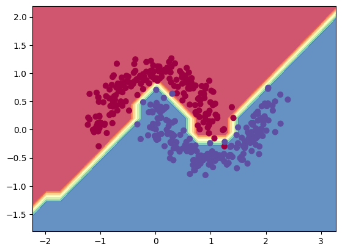

# slowgrad


Autograd engine built around einsum (work in progress. Its really slow.) Since NN's, CNN's, and even transformers can be written almost entirely with einsum, I thought it would be fun to write an autograd library that just implements the backward pass of einsum. Heavy inspiration taken from Andrej Kaparthy's [micrograd](https://github.com/karpathy/micrograd/tree/master)

The meat and potatoes are in `slowgrad/autograd/jacobian.py` which handles jacobian/gradient calculation, and then `slowgrad/engine.py` which is a wrapper for holding values. The rest of this junk is utils to make it feel more like pytorch.

### Example usage

```python
import torch
from slowgrad.engine import SlowgradVar
from slowgrad.models import (
    SlowgradSequential,
    SlowgradLinear,
    SlowgradSigmoid,
    SlowgradMSELoss,
)

model = SlowgradSequential([
    SlowgradLinear(2, 4, bias=True),
    SlowgradSigmoid(),
    SlowgradLinear(4, 4, bias=True),
    SlowgradSigmoid(),
    SlowgradLinear(4, 1, bias = True)
])

x, y = SlowgradVar(torch.randn(100, 2)), SlowgradVar(torch.randn(100, 1))

SlowgradMSELoss()(model(x), y).backward()
params = model.parameters()
for p in params:
    print(p.grad, '\n')

```
### NN example

Theres a training example of a nn in `example.ipynb`. Using a 3-layer network I got the following decision boundary on a moon dataset


